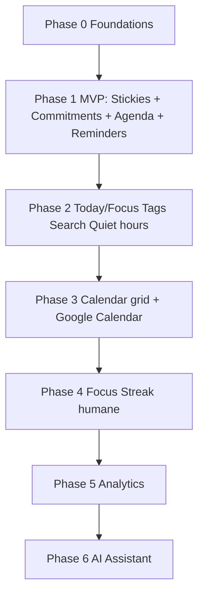

# 01 — Product Requirements Document

**Product:** SiroMan (docs historically used working title “StickyFlow”)  
**Status:** Approved for documentation phase · Pre-implementation  
**Version:** 1.0  
**Last updated:** 2026-07-24  
**Owners:** Product + Engineering  
**Related:** [02-user-personas](./02-user-personas.md) · [03-user-flows](./03-user-flows.md) · [04-feature-specification](./04-feature-specification.md) · [11-development-roadmap](./11-development-roadmap.md)

---

## 1. Vision

StickyFlow is a **commitment-keeping workspace**. It starts as a premium sticky-notes surface and evolves into a lightweight productivity platform—without becoming Notion, Linear, or Todoist clones.

**Mission**

> People don’t fail because they lack goals.  
> People fail because they forget their commitments.  
> StickyFlow helps users remember, organize, and complete their work.

**Wedge (positioning)**

> Capture once. Stay reminded until done. Never duplicate work.

| We are | We are not |
|--------|------------|
| Anti-forget layer for personal commitments | Second brain / wiki |
| Notes that become follow-through | Team issue tracker |
| Calm doodle-premium UX | Guilt-driven habit casino |

---

## 2. Problem statement

### Market failure modes

| Tool type | Failure |
|-----------|---------|
| Notes apps | Capture without obligation; graveyard effect |
| Task managers | High friction to capture; “task-shaped” thinking |
| Calendars | Time without context of the sticky |
| Reminder apps | One-shot dismissible pings |
| All-in-ones | Cognitive tax; users abandon the system |

### Jobs to be done

1. Park a thought in under 5 seconds.  
2. Get nudged proportionally as a deadline approaches.  
3. See commitments in time without re-entering data.  
4. Feel progress from **completing planned work**, not from opening the app.

---

## 3. Goals

### Product goals (MVP → 6 months)

1. Time-to-first-sticky &lt; 60 seconds median.  
2. Due-dated stickies become tracked commitments with zero manual duplication.  
3. Reminder engine improves completion without high opt-out.  
4. Board remains the calm primary surface as features expand.

### Business goals

1. Validate Solo Operator willingness to pay.  
2. Freemium wedge that never paywalls **capture**.  
3. Brand association with follow-through, not notes.

### Non-goals (hard)

- Team workspaces, comments, roles  
- Notion-like databases/wikis  
- Rewarding app opens / login chests  
- AI that auto-spawns large task lists  
- Native mobile parity on day one (web-first MVP)

---

## 4. Core product thesis (architecture implication)

**Critical design decision:** Do **not** create a separate Task row when a due date is set.

| Anti-pattern | StickyFlow model |
|--------------|------------------|
| Note + Task + CalendarEvent copies | One **Item**; views derive tasks/agenda/calendar |

When `dueAt` is set (or `trackAsCommitment` is true):

- Item is a **commitment**  
- Appears on Agenda / Calendar views  
- Remaining days computed  
- Reminder occurrences scheduled  

See [06-database-schema](./06-database-schema.md) and [04-feature-specification](./04-feature-specification.md).

---

## 5. Phased product flow (revised)

Original brief order put Calendar before Reminders. That delays the mission. **Accepted revision:**



| Phase | User-visible outcome |
|-------|----------------------|
| MVP | Wrote it once → reminded → finished |
| 2 | Run the week from Today |
| 3 | See commitments on a calendar |
| 4 | Consistency without guilt |
| 5 | Understand patterns |
| 6 | Assistant helps act, not plan forever |

Detail: [11-development-roadmap](./11-development-roadmap.md).

---

## 6. MVP scope

### In scope (P0)

- Sticky CRUD: create, edit, delete, pin, archive, colors  
- Title, description, due date, priority, tags, search  
- Unified commitment when due date exists  
- Remaining days / overdue affordance  
- Agenda view ( chronologic commitments )  
- Reminder engine (default cadence) + in-app inbox + Web Push  
- Snooze / complete from reminder path  
- Auth (Clerk), sync via API, account delete/export basics  
- Modern Doodle UI foundations  

### Out of MVP

- Drawing on stickies  
- Streaks  
- AI  
- Team features  
- Full month calendar grid (Agenda substitutes)  
- Google Calendar sync (Phase 3)  
- Multi-board spaces  

---

## 7. Reminder engine (product requirements)

### Default narrative cadence

```text
D−7 → D−5 → D−1 (Tomorrow) → D (Today) → Overdue
```

### Policy rules (MVP)

| State | Default local time | Notes |
|-------|--------------------|-------|
| D−7 | 09:00 | Checkpoint |
| D−5 | 09:00 | Mid nudge |
| D−1 | 09:00; +18:00 if High | Tomorrow |
| D | 09:00; +15:00 if still open | Day-of |
| Overdue | Daily 09:00 for 7 days, then weekly | High may stay daily longer |

**Always:**

- Respect quiet hours (Phase 2; MVP may use fixed 22:00–08:00 default)  
- Cancel pending reminders on complete/delete/clear due date  
- No duplicate fire within 6 hours for same item  
- In-app Reminder Inbox is source of truth if push fails  

Smarter policies (priority, digest, ML timing) ship after instrumentation. Spec: [04-feature-specification](./04-feature-specification.md) § Reminder Engine · [07-backend-architecture](./07-backend-architecture.md) § Workers.

---

## 8. Streak system (post-MVP product rules)

- Reward **completing planned commitments**, never opens.  
- If planned count = 0 → day is **neutral** (not a break).  
- Support **rest days**.  
- Consistency score is a rolling planned-completion ratio.  
- Never gate core features behind streaks.

---

## 9. Design direction

**Modern Doodle Design Language (MDL)** — Excalidraw / tldraw craft + Linear / Notion / Apple Notes calm.

- Hand-drawn border accents, rounded cards, large whitespace  
- White-first light theme for MVP; dark mode Phase 2  
- Premium, professional — never childish  
- Responsive web  

Full tokens & components: [10-ui-design-system](./10-ui-design-system.md).

---

## 10. Tech stack (locked for v1 planning)

| Layer | Choice |
|-------|--------|
| Frontend | Next.js 15, React 19, TypeScript, Tailwind, shadcn/ui, Framer Motion |
| Backend | Node.js + Express.js |
| DB | PostgreSQL + Prisma |
| Auth | Clerk |
| Notifications | Web Push (VAPID) |
| Calendar (Phase 3) | Google Calendar API |
| Deploy | Frontend: Vercel · API/workers: Railway · DB: Supabase or Railway Postgres |

Architecture: [07-backend-architecture](./07-backend-architecture.md) · [09-frontend-architecture](./09-frontend-architecture.md).

---

## 11. Success metrics

### North-star

**WCCR** — Weekly Commitment Completion Rate  
`completed_in_week / commitments_due_or_overdue_in_week`

### Leading indicators

| Metric | Target (directional) |
|--------|----------------------|
| Time-to-first-sticky | &lt; 60s median |
| % stickies with due date | 25–40% |
| Reminder → complete ≤ 24h | Track & improve |
| D7 / D30 retention | Above notes-app baseline for segment |
| Reminder master opt-out | Guardrail — keep low |

### Anti-metrics

Daily opens as success · stickies created without outcomes · streak length at expense of wellbeing.

---

## 12. Assumptions

1. Web-first MVP is acceptable for Solo Operators.  
2. Users will enable notifications if value appears in session one.  
3. Civil dates (all-day) dominate MVP; datetime is Phase 2.  
4. Clerk user IDs map 1:1 to app `User` rows.  
5. English + locale-aware dates first.  
6. Cloud Postgres + Express is sufficient before local-first.  
7. Web Push unreliability is mitigated by in-app inbox.  
8. Google Calendar is optional enrichment, not MVP-critical.

---

## 13. Risks

| Risk | Severity | Mitigation |
|------|----------|------------|
| Nagware uninstall | High | Snooze, quiet hours, priority policy, measure opt-out |
| Scope → Notion | High | Commitment test; hard non-goals |
| Note vs task confusion | High | One Item; clear UX copy |
| Doodle reads childish | Med | Typography restraint; no mascots |
| Web Push flaky | High | Inbox + reschedule worker |
| Calendar sync complexity | High | Defer to Phase 3; Agenda in MVP |

---

## 14. Open questions (blockers before code)

See also [11-development-roadmap](./11-development-roadmap.md) exit criteria.

1. Final product name / trademark?  
2. Freeform spatial board vs masonry/columns?  
3. Monetization boundary (what is free vs paid)?  
4. Supabase vs Railway for Postgres?  
5. E2E encryption (breaks server-side reminder content) — reject for MVP?

---

## 15. Exit criteria to start implementation

1. This PRD + docs `02`–`12` reviewed.  
2. MVP P0 list frozen.  
3. Reminder policy v1 approved.  
4. Platform ADRs accepted (this stack).  
5. MDL foundations designed ([10](./10-ui-design-system.md)).  
6. At least lightweight validation that “due date = tracked” is understood.

**Do not implement application code until the founder explicitly approves this documentation set.**
