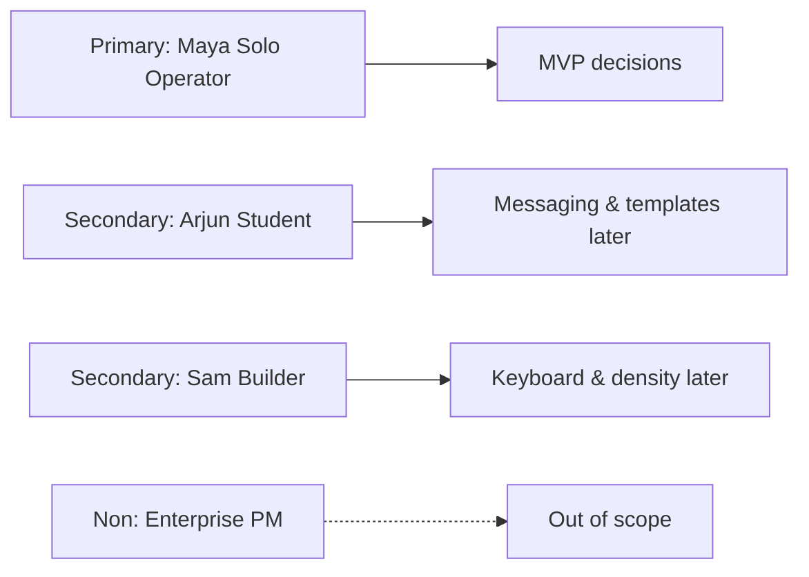
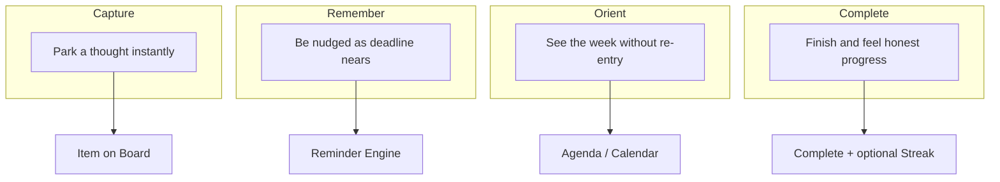

# 02 — User Personas

**Product:** StickyFlow  
**Version:** 1.0  
**Last updated:** 2026-07-24  
**Related:** [01-product-requirements](./01-product-requirements.md) · [03-user-flows](./03-user-flows.md) · [04-feature-specification](./04-feature-specification.md)

---

## 1. Persona strategy

StickyFlow does **not** launch for “everyone who is productive.”  

**Primary beachhead:** Solo Operator (freelancer / indie consultant).  
**Secondary:** Student, Builder/Founder.  
**Explicit non-personas:** Enterprise PM, wiki power-user, therapy-style habit seeker.

---

## 2. Primary — Maya Patel, Solo Operator

| Attribute | Detail |
|-----------|--------|
| Age | 28–38 |
| Role | Freelance product designer / brand consultant |
| Location | Metro / remote, APAC or US-friendly timezone |
| Devices | MacBook + phone browser; may install PWA later |
| Income | Variable; pays for 2–4 SaaS tools already |

### Context

Maya juggles 3–6 clients, invoices, personal admin, and learning goals. She has no manager. Soft deadlines slip. She dumps thoughts into Apple Notes and sticky pads, then loses them.

### Goals

- Capture commitments in seconds between calls.  
- Know what is due this week without a Sunday planning ritual.  
- Feel calm opening a tool — not dread.

### Frustrations

- Notion is “where ideas go to die.”  
- Todoist feels like work about work.  
- Calendar is empty while Notes are full.  
- Reminders are either silent or spammy.

### Behaviors

- Creates 5–15 notes/week; ~30% deserve dates.  
- Checks phone notifications frequently.  
- Abandons apps that need “setup.”

### StickyFlow success for Maya

1. Sticky with due Friday → appears in Agenda.  
2. Gentle reminders D−7…Today.  
3. Completes invoice from notification.  
4. Never copied the item into another app.

### Quotes (synthetic research targets)

> “I don’t need another system. I need the thing I already wrote to come back.”  
> “If it takes more than two clicks, I’ll text myself instead.”

### Feature priorities for Maya

| Need | MVP | Later |
|------|-----|-------|
| Fast capture | ✓ | |
| Due date → reminders | ✓ | |
| Agenda | ✓ | |
| Tags (client names) | ✓ light | filters |
| Google Calendar | | Phase 3 |
| Streaks | | Phase 4 |
| AI prioritization | | Phase 6 |

---

## 3. Secondary — Arjun Mehta, Student

| Attribute | Detail |
|-----------|--------|
| Age | 19–24 |
| Role | University student + club lead / internship hunt |
| Devices | Chromebook / Windows laptop + Android |

### Context

Assignment dates live in LMS portals; notes live in random apps; group work is chaotic. Seasonal intensity (midterms/finals).

### Goals

- Not miss submission deadlines.  
- Keep side-project ideas without losing exam tasks.

### Frustrations

- Too many school portals.  
- Habit apps guilt him during exam weeks.  
- Price sensitivity.

### Risks to StickyFlow

- High churn between terms.  
- Requests for LMS integrations (non-goal early).  
- May want shared class boards (defer).

### How we serve Arjun without building for him

- Same capture → due → remind loop.  
- Affordable free tier.  
- No campus-specific roadmap until retention among Solo Operators is proven.

---

## 4. Secondary — Sam Okonkwo, Builder / Founder

| Attribute | Detail |
|-----------|--------|
| Age | 25–40 |
| Role | Indie hacker / early startup founder / full-stack eng |
| Devices | Desktop-first, keyboard heavy |

### Context

Ships product features; drops admin (taxes, emails, partner follow-ups). Mixes idea notes and todos in one dump.

### Goals

- Keyboard-first capture.  
- Separate “someday ideas” from dated commitments visually.  
- Trust sync across devices.

### Frustrations

- Linear is for the team, not personal life.  
- Too many GitHub issues for life admin.

### StickyFlow implications

- Shortcuts Phase 2 ([09-frontend-architecture](./09-frontend-architecture.md)).  
- Undated stickies stay notes; dated become commitments.  
- Optional later: GitHub/Linear import — **not** MVP.

---

## 5. Anti-personas (do not design for)

| Anti-persona | Why exclude |
|--------------|-------------|
| Enterprise program manager | Needs assignees, permissions, audit — out of scope |
| Knowledge base librarian | Needs databases, relations, wikis |
| Habit coach seeker | Wants behavioral therapy UX; streak guilt risk |
| Team design org | Collaboration features delay wedge |

---

## 6. Persona → UX implications

| Principle | Maya | Arjun | Sam |
|-----------|------|-------|-----|
| ≤2 clicks to create | Critical | Critical | Critical |
| Reminder respect | Critical | High | High |
| Board calm whitespace | Critical | Med | Med |
| Keyboard shortcuts | Med | Low | Critical |
| Free tier viability | Med | Critical | Low |
| Calendar sync | High (later) | Med | Med |

Design system must pass Maya’s “professional doodle” bar: [10-ui-design-system](./10-ui-design-system.md).

---

## 7. Jobs-to-be-done map

---

## 8. Research plan (pre-implementation)

| Activity | n | Output |
|----------|---|--------|
| Problem interviews (Solo Operators) | 5–10 | Pain validation |
| Competitive task (Keep / Todoist / Reminders) | 5 | Differentiation proof |
| Prototype test: due date → agenda → reminder mock | 5 | Comprehension of unified model |
| Naming test | optional | StickyFlow trademark + clarity |

Assumptions to falsify:

1. Users will set due dates on stickies without training.  
2. Escalating reminders feel “caring,” not “nagging.”  
3. Doodle UI reads premium to freelancers.

---

## 9. Edge cases by persona

| Scenario | Persona | Product response |
|----------|---------|------------------|
| 40 undated idea stickies | Sam | Stay notes; no reminder spam |
| Exam week, 12 dues in 3 days | Arjun | Priority-aware cadence; Today view |
| Client timezone mismatch | Maya | Store civil date in user TZ ([06](./06-database-schema.md)) |
| Disables all notifications | Maya | In-app inbox + Agenda still work |
| Zero commitments planned today | All | Streak day neutral (Phase 4) |

---

## 10. Messaging per persona (marketing later)

| Persona | Headline angle |
|---------|----------------|
| Maya | Sticky notes that don’t let client work slip |
| Arjun | Deadlines that find you before the portal does |
| Sam | Capture like Notes. Follow through like a task manager |

Primary site copy ships for **Maya**.
