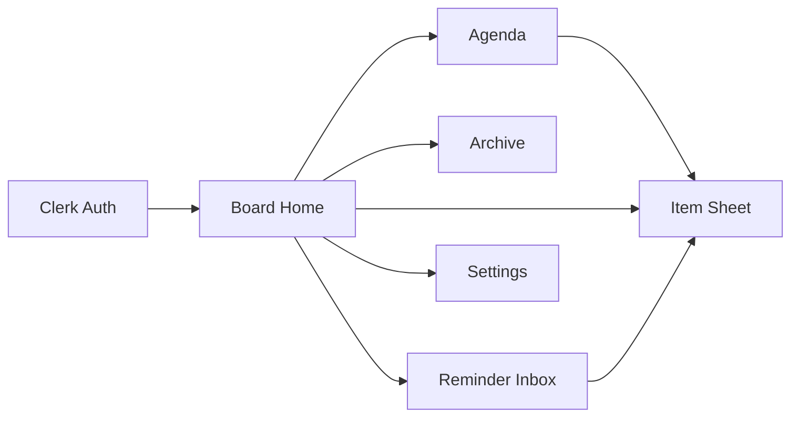
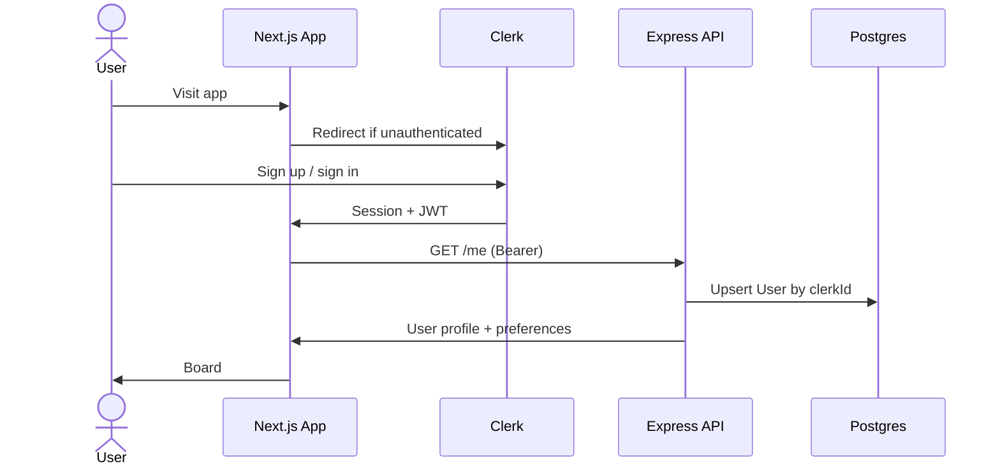
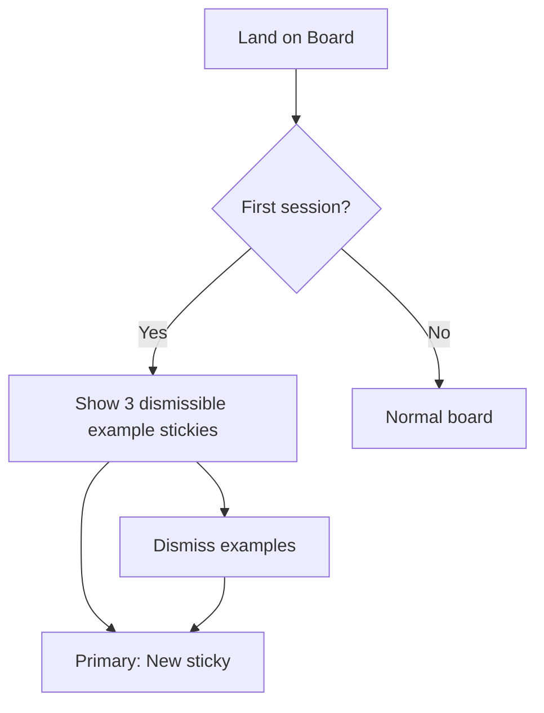
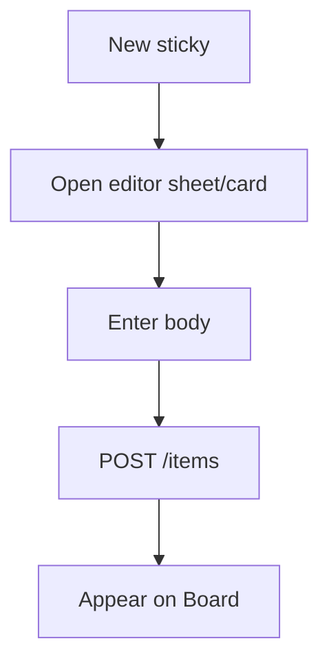
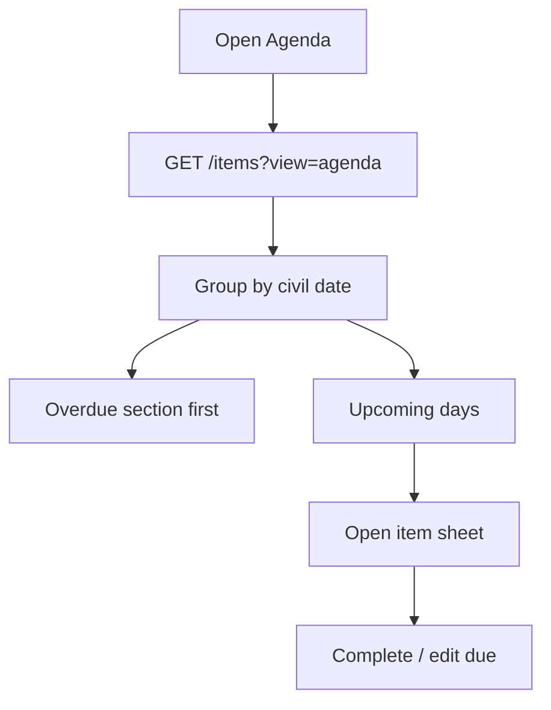
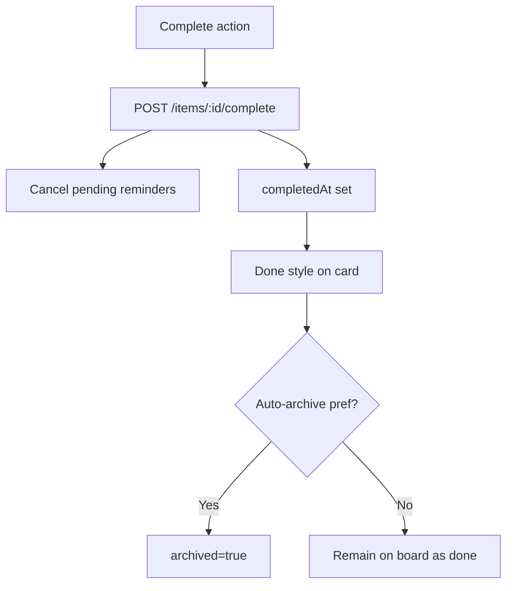
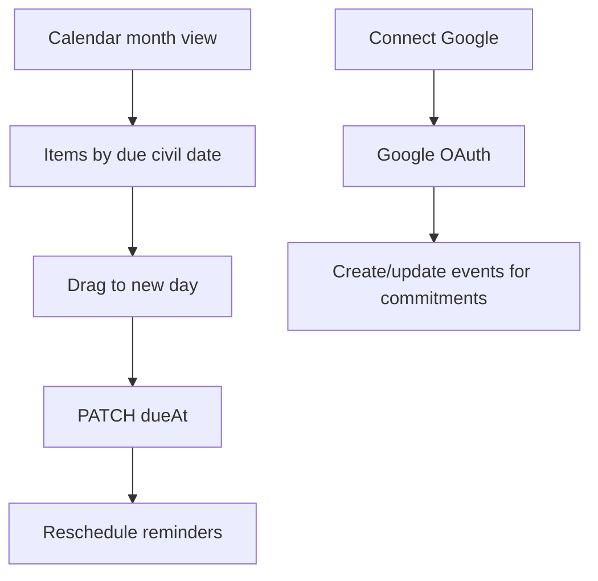
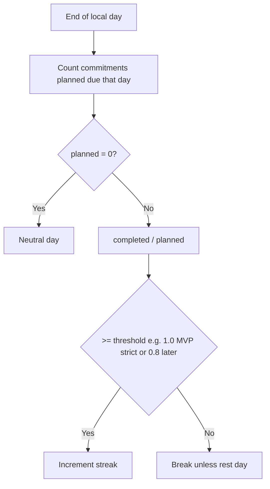

# 03 — User Flows

**Product:** StickyFlow  
**Version:** 1.0  
**Last updated:** 2026-07-24  
**Related:** [01-product-requirements](./01-product-requirements.md) · [02-user-personas](./02-user-personas.md) · [04-feature-specification](./04-feature-specification.md) · [08-api-specification](./08-api-specification.md)

---

## 1. Flow index

| ID | Flow | Phase |
|----|------|-------|
| F01 | Sign up / sign in (Clerk) | MVP |
| F02 | First-run onboarding | MVP |
| F03 | Create sticky | MVP |
| F04 | Edit sticky fields | MVP |
| F05 | Set due date → commitment | MVP |
| F06 | Pin / unpin | MVP |
| F07 | Archive / restore | MVP |
| F08 | Delete sticky | MVP |
| F09 | Search & filter | MVP |
| F10 | Agenda navigation | MVP |
| F11 | Complete commitment | MVP |
| F12 | Reminder receive → act | MVP |
| F13 | Snooze reminder | MVP |
| F14 | Enable Web Push | MVP |
| F15 | Clear due date (demote) | MVP |
| F16 | Today / Focus view | Phase 2 |
| F17 | Calendar grid + reschedule | Phase 3 |
| F18 | Connect Google Calendar | Phase 3 |
| F19 | Streak day resolution | Phase 4 |
| F20 | Analytics glance | Phase 5 |
| F21 | AI suggest next action | Phase 6 |

---

## 2. Global navigation map



Primary surface: **Board**. Secondary: Agenda, Inbox, Archive, Settings.  
IA detail: [05-information-architecture](./05-information-architecture.md).

---

## 3. F01 — Sign up / sign in



**Edge cases**

| Case | Behavior |
|------|----------|
| OAuth cancel | Return to marketing/sign-in; no orphan data |
| API upsert fails | Show retry; do not infinite loop |
| Banned/deleted Clerk user | 401; clear local cache |

---

## 4. F02 — First-run onboarding

**Goal:** Teach one idea — *due dates track commitments* — in &lt; 30 seconds.



Example stickies (seeded client-side or API flag `onboardingCompleted`):

1. “Welcome — edit me” (no due)  
2. “Try a due date → see Agenda” (due in 3 days)  
3. “Pin important notes” (pinned)

**Edge cases:** Returning user with `onboardingCompleted=true` never sees seeds. User deletes all examples → empty state CTA only.

---

## 5. F03 — Create sticky

**Happy path (≤2 interactions)**

1. Click **New sticky** / press `C` (Phase 2 shortcut).  
2. Type description (required) / optional title.  
3. Autosave on blur or explicit Save (prefer autosave debounce 400ms).



**Edge cases**

| Case | Behavior |
|------|----------|
| Empty body & empty title | Block save; inline error |
| Offline (Phase 2) | Queue; MVP: show offline toast |
| 500 on create | Keep draft local; retry |
| Rapid double-click New | Single draft only |

---

## 6. F05 — Set due date → commitment (core)

```mermaid
sequenceDiagram
  actor U as User
  participant W as Web
  participant A as API
  participant DB as DB
  participant R as Reminder Worker

  U->>W: Pick due date on sticky
  W->>A: PATCH /items/:id { dueAt }
  A->>DB: Update item; derive commitment
  A->>DB: Cancel old ReminderOccurrences
  A->>DB: Insert new ReminderOccurrences per policy
  A->>W: Item + remainingDays
  Note over R: Later fires due rows
  W->>U: Chip "3 days"; listed in Agenda
```

**Rules**

- No second “Task” entity created.  
- Agenda/Calendar are queries on `dueAt IS NOT NULL`.  
- Changing due date reschedules reminders.

**Edge cases**

| Case | Behavior |
|------|----------|
| Due date in the past | Allowed; status=overdue; schedule overdue policy |
| Due date cleared | Demote to note; cancel future reminders (F15) |
| Due date = today | Schedule today policy immediately |
| User TZ change | Recompute civil dates on next preference update |

---

## 7. F10 — Agenda



**Empty state:** “Nothing due — enjoy the whitespace” + CTA create with date.

---

## 8. F11 — Complete commitment



**Edge cases:** Complete undated note → allowed (marks done) but no streak credit until Phase 4 rules. Reopen → `POST /items/:id/reopen` clears `completedAt`, reschedules if `dueAt` future/overdue.

---

## 9. F12 / F13 — Reminder receive & snooze

```mermaid
sequenceDiagram
  participant W as Worker
  participant DB as DB
  participant Push as Web Push
  participant U as User
  participant App as Web App

  W->>DB: Claim due ReminderOccurrence
  W->>Push: Send notification
  W->>DB: Mark sent + ensure Inbox row
  U->>App: Click notification / open Inbox
  App->>U: Item actions: Complete / Snooze / Open
  U->>App: Snooze "Tomorrow"
  App->>DB: occurrence snoozed; new fireAt
```

**Snooze presets (MVP):** 1 hour · Later today (18:00) · Tomorrow 09:00.

**Edge cases**

| Case | Behavior |
|------|----------|
| Push permission denied | Inbox only; soft prompt in Settings |
| Notification click with stale item | 404 page → Board |
| Multiple devices | Each push subscription receives; complete is idempotent |
| Already completed before click | Show “Already done” |

---

## 10. F14 — Enable Web Push

1. Settings → Notifications → Enable.  
2. Browser permission prompt.  
3. `POST /push-subscriptions` with endpoint + keys.  
4. Test notification optional.

**Edge cases:** Safari/iOS limitations documented in UI; Firefox private mode may fail — show unsupported message.

---

## 11. F06–F08 — Pin, archive, delete

| Flow | Steps | Notes |
|------|-------|-------|
| Pin | Toggle pin → PATCH | Pinned zone above board |
| Archive | Archive → hidden from board | Reminder: cancel if archived? **Yes** cancel future; restore may reschedule if due future |
| Delete | Confirm modal → DELETE | Hard delete reminders + item |

---

## 12. F09 — Search

1. Focus search (`/` Phase 2).  
2. Debounced `GET /items?q=`.  
3. Results highlight title/body/tag matches.  
4. Click opens item; Esc clears.

**Edge cases:** Empty query restores board. No results → clear empty state. XSS: render plain text only.

---

## 13. Phase 3 — F17 / F18 Calendar



Sync policy detailed in [04-feature-specification](./04-feature-specification.md) and [07-backend-architecture](./07-backend-architecture.md). MVP uses **Agenda only**.

---

## 14. Phase 4 — F19 Streak

Nightly job (user TZ end-of-day):



---

## 15. Error & empty patterns (all flows)

| Pattern | UX |
|---------|----|
| Loading | Skeleton cards matching doodle shape |
| Error | Calm callout + Retry |
| Empty board | Single CTA + one-line teaching |
| Conflict (rare) | Last-write-wins toast “Updated elsewhere” |

---

## 16. Accessibility flow requirements

- All flows operable by keyboard.  
- Reminder actions reachable without relying on color alone.  
- Confirm delete is focus-trapped dialog.  
- `prefers-reduced-motion` disables Framer flourish.

See [10-ui-design-system](./10-ui-design-system.md) · [12-testing-checklist](./12-testing-checklist.md).
