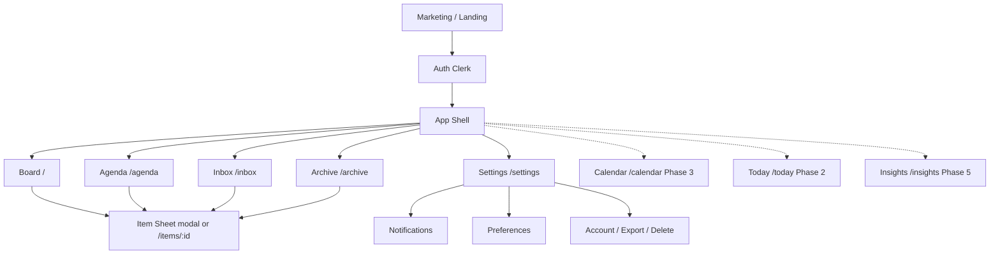
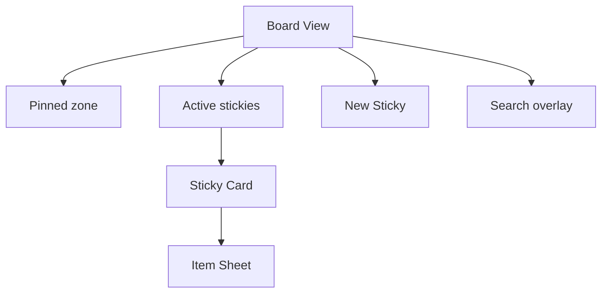
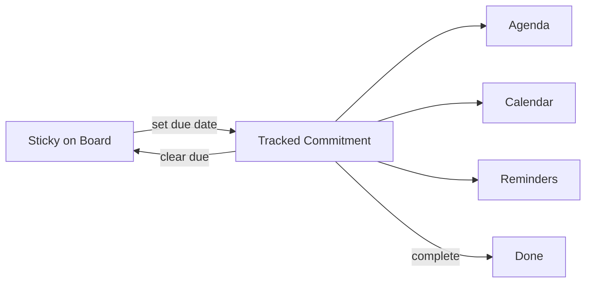

# 05 — Information Architecture

**Product:** StickyFlow  
**Version:** 1.0  
**Last updated:** 2026-07-24  
**Related:** [03-user-flows](./03-user-flows.md) · [09-frontend-architecture](./09-frontend-architecture.md) · [10-ui-design-system](./10-ui-design-system.md)

---

## 1. IA principles

1. **Board is home** — one primary mental model.  
2. **One object, many views** — Item appears as sticky, agenda row, calendar cell, reminder target.  
3. **Progressive disclosure** — advanced controls inside the item sheet, not on the board chrome.  
4. **Minimal nav** — ≤5 top-level destinations in MVP.  
5. **Teach in empty states** — never a separate 10-step tutorial tour (optional coach marks only).

---

## 2. Sitemap (MVP → Phase 3)



---

## 3. Navigation chrome

### 3.1 Desktop

| Region | Content |
|--------|---------|
| Left rail (narrow) or top bar | Logo, Board, Agenda, Inbox badge, Archive, Settings |
| Main | Active view |
| Floating | New Sticky CTA |

### 3.2 Mobile

| Region | Content |
|--------|---------|
| Top | Title + search icon + avatar |
| Main | View |
| Bottom tab bar | Board · Agenda · Inbox · More |

**Inbox badge:** count of unread reminder inbox items.

---

## 4. Board IA



### Sticky card (compact)

- Color wash + doodle border  
- Title or first line of description  
- Priority dot (if not none)  
- Due chip: `3d` / `Tomorrow` / `Overdue`  
- Pin glyph if pinned  
- Tags: max 2 visible +N  

### Item sheet (full)

Sections in order:

1. Title  
2. Description  
3. Due date · Priority · Color  
4. Tags  
5. Pin / Archive / Complete  
6. Danger: Delete  

No nested pages inside sheet.

---

## 5. Agenda IA

```
Overdue
  └─ items…
Today
  └─ items…
Tomorrow
  └─ items…
Wed, Jul 30
  └─ items…
…
```

Row content: color tick · title · priority · tags · remaining.

---

## 6. Reminder Inbox IA

| Tab/filter | Content |
|------------|---------|
| Unread | pending/sent/read=false |
| All | history 30 days |
| Snoozed | future snooze fires |

Row actions: Complete · Snooze · Open · Dismiss (marks read, no reschedule).

---

## 7. Settings IA

```text
Settings
├── Preferences
│   ├── Timezone
│   ├── Week starts on
│   └── Auto-archive on complete
├── Notifications
│   ├── Enable Web Push
│   ├── Test notification
│   └── Quiet hours (Phase 2)
├── Calendar (Phase 3)
│   └── Google connection
└── Account
    ├── Export data
    └── Delete account
```

---

## 8. Object model (user mental model)



Copy guidelines:

- Prefer “due date tracks this” over “we created a task.”  
- Settings may say “Tasks & reminders” as a section label later; schema stays `Item`.

---

## 9. URL scheme

| Path | View | Auth |
|------|------|------|
| `/` | Marketing or redirect to `/app` | Public |
| `/sign-in` `/sign-up` | Clerk | Public |
| `/app` | Board | Private |
| `/app/agenda` | Agenda | Private |
| `/app/inbox` | Inbox | Private |
| `/app/archive` | Archive | Private |
| `/app/settings` | Settings | Private |
| `/app/items/[id]` | Deep link item | Private |
| `/app/today` | Today | Phase 2 |
| `/app/calendar` | Calendar | Phase 3 |
| `/app/insights` | Analytics | Phase 5 |

Deep links from push: `/app/items/:id?occurrence=:occurrenceId`.

---

## 10. Content hierarchy & teaching

| Surface | One job | One headline idea |
|---------|---------|-------------------|
| Board | Capture & arrange | Your stickies live here |
| Agenda | Orient in time | What’s due |
| Inbox | Act on nudges | Don’t miss these |
| Archive | Retrieve old | Out of the way, not gone |
| Settings | Control | Make it yours |

---

## 11. Cross-view consistency rules

1. Completing in any view completes everywhere instantly (optimistic UI + invalidate queries).  
2. Color and title always match.  
3. Archived items never appear on Board/Agenda/Inbox active lists.  
4. Search can find archived with explicit filter (Phase 2); MVP search = active only.

---

## 12. Scalability of IA

| Growth | IA response |
|--------|-------------|
| 500+ stickies | Search + filters mandatory; optional list layout mode |
| Multi-space (Phase 7) | Space switcher above Board; default “Personal” |
| AI (Phase 6) | Side panel, not a new top-level tab until proven |
| Teams (if ever) | Separate product surface — do not bolt onto Personal IA |

---

## 13. Assumptions

- Single personal workspace per user in MVP.  
- Modal/sheet &gt; full page for item editing on desktop.  
- Marketing site can be minimal (`/`) until growth phase.
