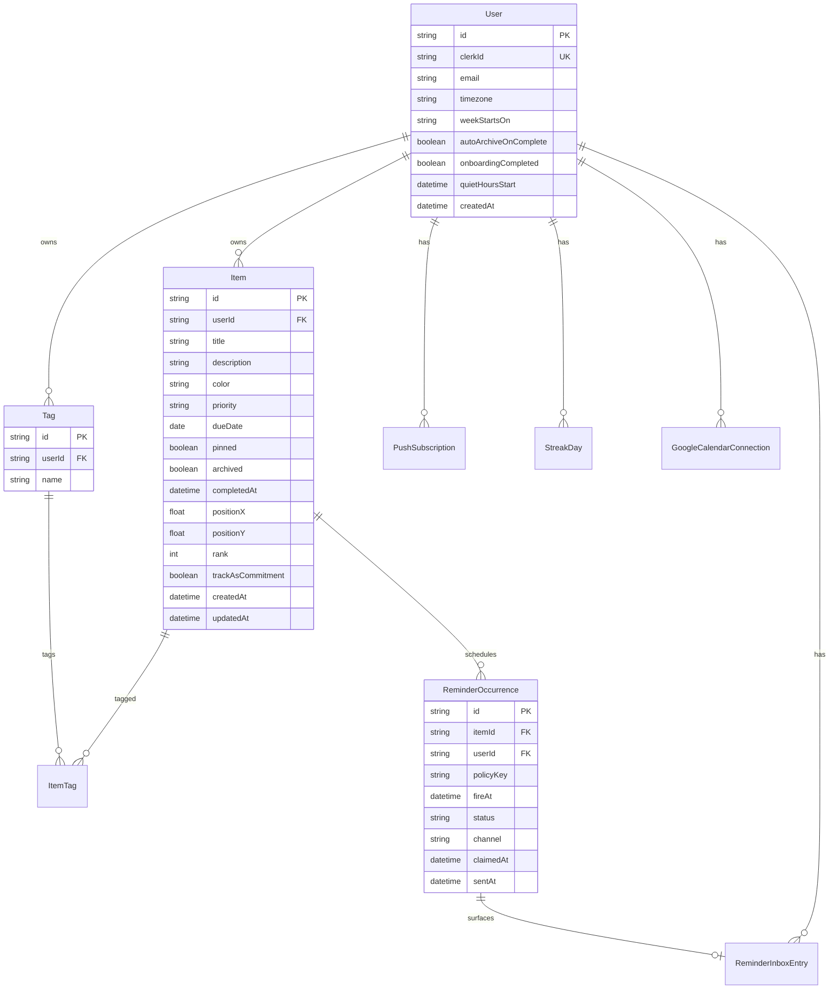

# 06 — Database Schema

**Product:** StickyFlow  
**Version:** 1.0  
**Last updated:** 2026-07-24  
**Stack:** PostgreSQL + Prisma  
**Related:** [04-feature-specification](./04-feature-specification.md) · [07-backend-architecture](./07-backend-architecture.md) · [08-api-specification](./08-api-specification.md)

---

## 1. Design principles

1. **One `Item` table** for stickies/commitments — no parallel `tasks` table.  
2. **Reminders are data** (`ReminderOccurrence`) scheduled by policy, claimed by workers.  
3. **Clerk is source of auth**; `User.clerkId` is the join key.  
4. **Civil dates:** store `dueDate` as `DATE` for MVP all-day commitments; optional `dueTime` later.  
5. **Soft preferences** on User; avoid EAV.  
6. Indexes for: user-scoped lists, due agenda, reminder due-to-fire polling.

---

## 2. ER diagram



---

## 3. Prisma models (canonical)

```prisma
// prisma/schema.prisma — canonical target (do not implement until approved)

generator client {
  provider = "prisma-client-js"
}

datasource db {
  provider = "postgresql"
  url      = env("DATABASE_URL")
}

enum Priority {
  none
  low
  medium
  high
}

enum StickyColor {
  butter
  mist
  sage
  blush
  slate
  lavender
  peach
  ink
}

enum ReminderStatus {
  scheduled
  claimed
  sent
  snoozed
  cancelled
  failed
}

enum ReminderChannel {
  inbox
  webpush
}

enum WeekStart {
  sunday
  monday
}

model User {
  id                     String   @id @default(cuid())
  clerkId                String   @unique
  email                  String?
  displayName            String?
  timezone               String   @default("UTC") // IANA
  weekStartsOn           WeekStart @default(monday)
  autoArchiveOnComplete  Boolean  @default(false)
  onboardingCompleted    Boolean  @default(false)
  quietHoursStartMinute  Int      @default(1320) // 22:00
  quietHoursEndMinute    Int      @default(480)  // 08:00
  remindersEnabled       Boolean  @default(true)
  createdAt              DateTime @default(now())
  updatedAt              DateTime @updatedAt

  items              Item[]
  tags               Tag[]
  pushSubscriptions  PushSubscription[]
  reminderOccurrences ReminderOccurrence[]
  inboxEntries       ReminderInboxEntry[]
  streakDays         StreakDay[]
  googleConnection   GoogleCalendarConnection?
}

model Item {
  id                 String       @id @default(cuid())
  userId             String
  title              String?      @db.VarChar(120)
  description        String       @db.Text
  color              StickyColor  @default(butter)
  priority           Priority     @default(none)
  dueDate            DateTime?    @db.Date
  pinned             Boolean      @default(false)
  archived           Boolean      @default(false)
  completedAt        DateTime?
  positionX          Float?       @default(0)
  positionY          Float?       @default(0)
  rank               Int          @default(0)
  trackAsCommitment  Boolean      @default(false)
  createdAt          DateTime     @default(now())
  updatedAt          DateTime     @updatedAt

  user        User                 @relation(fields: [userId], references: [id], onDelete: Cascade)
  tags        ItemTag[]
  reminders   ReminderOccurrence[]
  inbox       ReminderInboxEntry[]
  googleEvent GoogleEventMap?

  @@index([userId, archived, pinned])
  @@index([userId, dueDate])
  @@index([userId, completedAt])
  @@index([userId, updatedAt])
}

model Tag {
  id     String @id @default(cuid())
  userId String
  name   String @db.VarChar(40)

  user  User      @relation(fields: [userId], references: [id], onDelete: Cascade)
  items ItemTag[]

  @@unique([userId, name])
  @@index([userId])
}

model ItemTag {
  itemId String
  tagId  String

  item Item @relation(fields: [itemId], references: [id], onDelete: Cascade)
  tag  Tag  @relation(fields: [tagId], references: [id], onDelete: Cascade)

  @@id([itemId, tagId])
}

model ReminderOccurrence {
  id         String           @id @default(cuid())
  itemId     String
  userId     String
  policyKey  String           @db.VarChar(64)
  fireAt     DateTime
  status     ReminderStatus   @default(scheduled)
  channel    ReminderChannel  @default(webpush)
  claimedAt  DateTime?
  sentAt     DateTime?
  lastError  String?
  createdAt  DateTime         @default(now())
  updatedAt  DateTime         @updatedAt

  item  Item                @relation(fields: [itemId], references: [id], onDelete: Cascade)
  user  User                @relation(fields: [userId], references: [id], onDelete: Cascade)
  inbox ReminderInboxEntry?

  @@index([status, fireAt])
  @@index([userId, fireAt])
  @@index([itemId, status])
  @@unique([itemId, policyKey, fireAt])
}

model ReminderInboxEntry {
  id           String    @id @default(cuid())
  userId       String
  itemId       String
  occurrenceId String    @unique
  title        String
  body         String?
  readAt       DateTime?
  createdAt    DateTime  @default(now())

  user       User               @relation(fields: [userId], references: [id], onDelete: Cascade)
  item       Item               @relation(fields: [itemId], references: [id], onDelete: Cascade)
  occurrence ReminderOccurrence @relation(fields: [occurrenceId], references: [id], onDelete: Cascade)

  @@index([userId, readAt, createdAt])
}

model PushSubscription {
  id        String   @id @default(cuid())
  userId    String
  endpoint  String   @unique
  p256dh    String
  auth      String
  userAgent String?
  createdAt DateTime @default(now())
  updatedAt DateTime @updatedAt

  user User @relation(fields: [userId], references: [id], onDelete: Cascade)

  @@index([userId])
}

model StreakDay {
  id             String   @id @default(cuid())
  userId         String
  date           DateTime @db.Date
  plannedCount   Int      @default(0)
  completedCount Int      @default(0)
  isRest         Boolean  @default(false)
  isSuccess      Boolean  @default(false)
  isNeutral      Boolean  @default(false)
  createdAt      DateTime @default(now())

  user User @relation(fields: [userId], references: [id], onDelete: Cascade)

  @@unique([userId, date])
}

model GoogleCalendarConnection {
  id           String   @id @default(cuid())
  userId       String   @unique
  refreshToken String   // encrypt at rest in app layer
  accessToken  String?
  expiresAt    DateTime?
  calendarId   String   @default("primary")
  syncEnabled  Boolean  @default(true)
  createdAt    DateTime @default(now())
  updatedAt    DateTime @updatedAt

  user User @relation(fields: [userId], references: [id], onDelete: Cascade)
}

model GoogleEventMap {
  id            String @id @default(cuid())
  itemId        String @unique
  googleEventId String
  calendarId    String

  item Item @relation(fields: [itemId], references: [id], onDelete: Cascade)
}

model AuditLog {
  id        String   @id @default(cuid())
  userId    String?
  action    String
  meta      Json?
  createdAt DateTime @default(now())

  @@index([userId, createdAt])
}
```

---

## 4. Field notes & invariants

| Invariant | Enforcement |
|-----------|-------------|
| `description` non-empty on create | API validation |
| Tag names unique per user, lowercase | API normalize + DB unique |
| Completing sets `completedAt`; clears on reopen | Service layer |
| Archive ⇒ cancel scheduled reminders | Service layer transaction |
| dueDate change ⇒ reschedule | `ReminderService.rebuildForItem` |
| User delete ⇒ cascade all | Prisma `onDelete: Cascade` + Clerk webhook |

### Timezone & `dueDate`

- `dueDate` stored as Postgres `DATE` (no time).  
- Reminder `fireAt` stored as absolute `timestamptz` computed from `dueDate` + policy + `user.timezone`.  
- Display “remaining days” uses user TZ “today”.

---

## 5. Derived queries

### Agenda

```sql
SELECT * FROM "Item"
WHERE "userId" = $1
  AND archived = false
  AND "completedAt" IS NULL
  AND "dueDate" IS NOT NULL
ORDER BY "dueDate" ASC, priority DESC;
```

### Reminder poll (worker)

```sql
SELECT * FROM "ReminderOccurrence"
WHERE status = 'scheduled'
  AND "fireAt" <= NOW()
ORDER BY "fireAt" ASC
LIMIT 100
FOR UPDATE SKIP LOCKED;
```

---

## 6. Migrations strategy

1. Prisma migrate in CI against staging.  
2. Expand/contract for renames.  
3. Seed script: noop for production; demo user only in staging.  
4. Never log note content in `AuditLog` by default (IDs only).

---

## 7. Scalability

| Scale | Plan |
|-------|------|
| 100k users · ~50 items avg | Single Postgres OK |
| Reminder hot path | Partial index on `(status, fireAt)`; separate worker replicas |
| Search | MVP ILIKE; later Postgres FTS or Typesense |
| Multi-tenant teams | New `Workspace` table — not bolted onto User casually |

---

## 8. Privacy / encryption

| Data | Handling |
|------|----------|
| Note content | TLS + DB at rest (provider) |
| Google refresh tokens | Application-level encryption (KMS/env key) |
| Push endpoints | Treat as sensitive |
| E2E encryption | **Out of MVP** — would block server-side reminder content |

---

## 9. Example row lifecycle

1. Create item without dueDate → note.  
2. PATCH dueDate = 2026-08-01 → insert occurrences for policy keys.  
3. Worker claims `d_minus_7` → push + inbox.  
4. User completes → `completedAt=now`, occurrences → `cancelled`.  
5. Archive optional via preference.

---

## 10. Assumptions

- `cuid()` IDs acceptable (not UUIDv7 required).  
- Soft-delete on Item not required if Archive covers UX.  
- `AuditLog` optional in MVP but schema reserved.  
- Streak/Google tables ship in schema early **or** migrate in phase — prefer **phase migrations** to keep MVP lean; document models now for planning.

**MVP migration subset:** User, Item, Tag, ItemTag, ReminderOccurrence, ReminderInboxEntry, PushSubscription.  
**Defer physical tables:** StreakDay, Google* until their phases (keep in this doc as target design).
