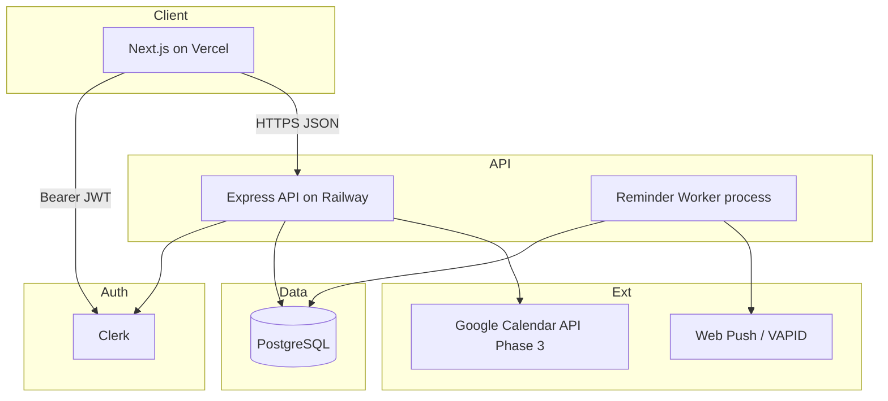
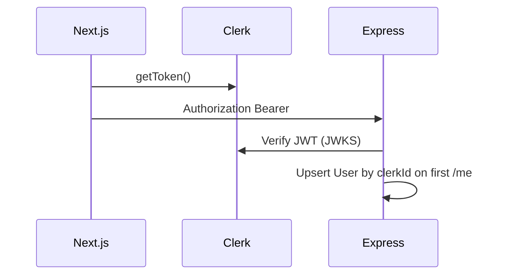
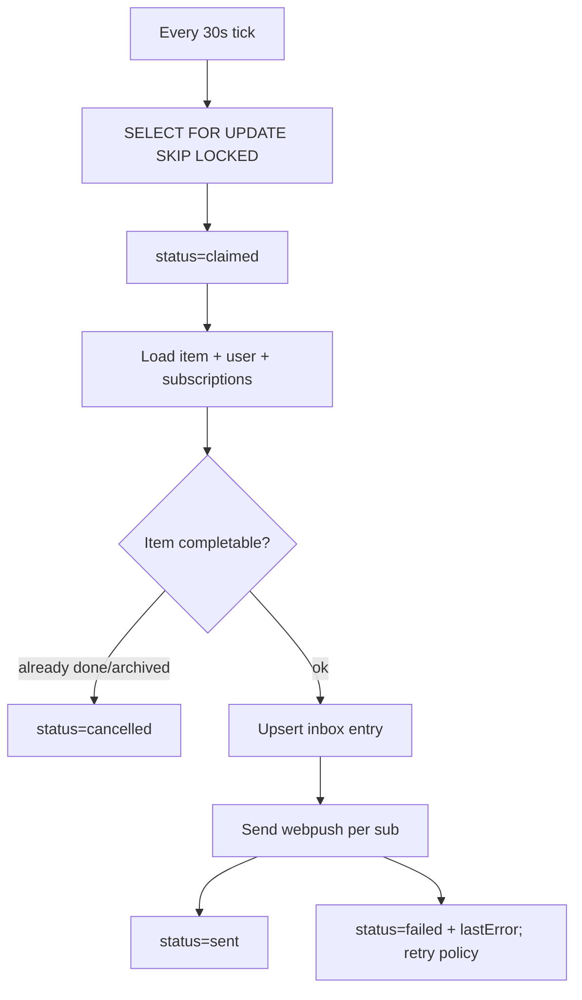
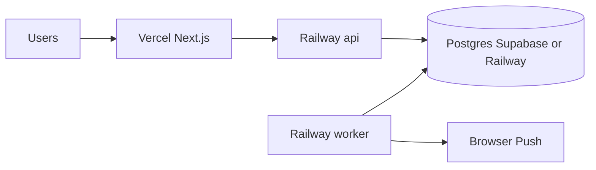
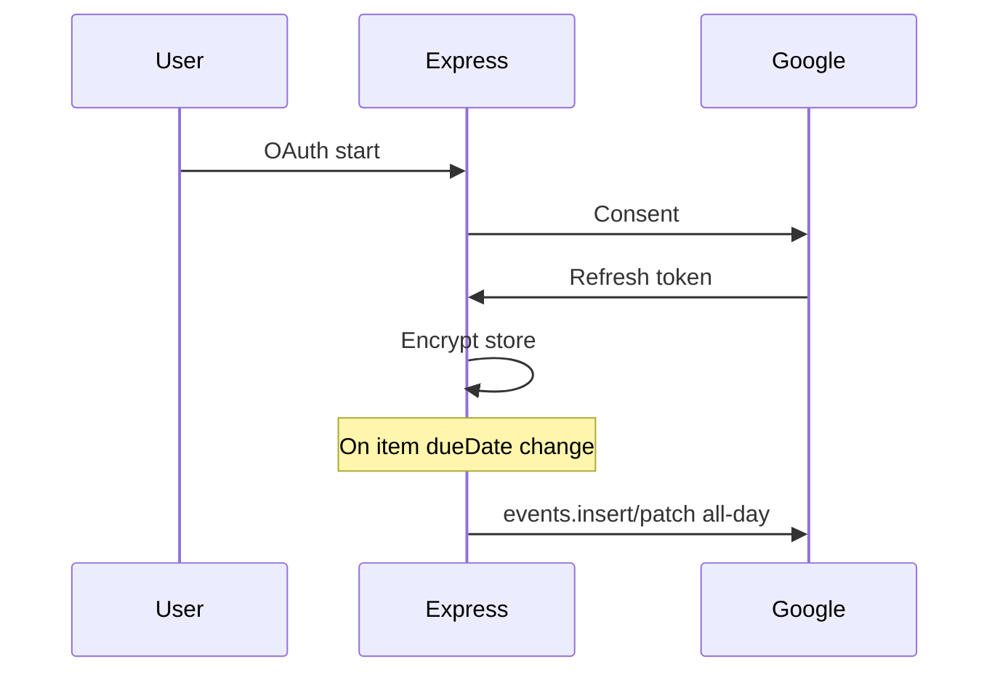

# 07 — Backend Architecture

**Product:** StickyFlow  
**Version:** 1.0  
**Last updated:** 2026-07-24  
**Stack:** Node.js · Express.js · Prisma · PostgreSQL · Clerk · Web Push  
**Related:** [06-database-schema](./06-database-schema.md) · [08-api-specification](./08-api-specification.md) · [11-development-roadmap](./11-development-roadmap.md)

---

## 1. High-level system



**Why split Next + Express:** Reminder workers and long-running pollers do not fit cleanly on Vercel serverless. Next.js is UI + BFF-light; Express owns domain API + jobs.

---

## 2. Process model

| Process | Role | Scale |
|---------|------|-------|
| `api` | HTTP REST JSON | Horizontal behind Railway |
| `worker` | Poll/claim reminders, send push, write inbox | 1–N with `SKIP LOCKED` |
| Optional `scheduler` | Cron tick to enqueue (can be same as worker setInterval) | 1 |

MVP may run `api` + `worker` as two Railway services sharing `DATABASE_URL`.

---

## 3. Directory structure (target)

```text
apps/api/
  src/
    index.ts                 # HTTP listen
    app.ts                   # Express app
    config/env.ts
    middleware/
      auth.ts                # Clerk JWT verify
      error.ts
      requestId.ts
      rateLimit.ts
    routes/
      me.ts
      items.ts
      tags.ts
      inbox.ts
      push.ts
      export.ts
    services/
      userService.ts
      itemService.ts
      reminderService.ts
      pushService.ts
      streakService.ts       # Phase 4
      googleCalendarService.ts # Phase 3
    workers/
      reminderWorker.ts
    lib/
      prisma.ts
      dates.ts               # TZ + civil date helpers
      logger.ts
  prisma/
    schema.prisma
    migrations/
```

Monorepo optional (`apps/web`, `apps/api`, `packages/shared`). Shared Zod types recommended.

---

## 4. Auth architecture



**Middleware responsibilities**

- Reject missing/invalid JWT (401).  
- Attach `req.auth = { clerkId, userId? }`.  
- Resolve DB user; if missing, create on `/me` or auto-upsert.  
- Authorize all queries with `userId` — **never** trust client-provided userId.

**Webhooks:** Clerk `user.deleted` → cascade delete app user.

---

## 5. Domain services

### 5.1 ItemService

| Method | Behavior |
|--------|----------|
| `create` | Validate; insert; if dueDate → `ReminderService.rebuildForItem` |
| `update` | Patch; if dueDate/priority/archive/complete changed → reminder side effects |
| `complete` | Transaction: completedAt, optional archive, cancel reminders |
| `reopen` | Clear completedAt; rebuild reminders |
| `delete` | Cascade |

### 5.2 ReminderService

| Method | Behavior |
|--------|----------|
| `rebuildForItem(itemId)` | Cancel `scheduled` rows; insert policy occurrences |
| `snooze(occurrenceId, until)` | Mark snoozed; insert one-off |
| `cancelForItem` | All non-terminal → cancelled |

**Policy computation** uses `lib/dates.ts` + user timezone. Skip policy keys whose fireAt would be before `now` (except overdue generator).

### 5.3 PushService

- `web-push` library with VAPID keys.  
- On 410/404 → delete subscription.  
- Always create `ReminderInboxEntry` even if all pushes fail.

---

## 6. Reminder worker design



### Reliability

| Concern | Approach |
|---------|----------|
| Double send | Claim status + unique constraints |
| Poison messages | `failed` after N tries; alert metrics |
| Backlog | Increase worker replicas; keep poll batch ≤100 |
| DST | Luxon/Temporal; store fireAt UTC instant |

### Retry policy

- Transient push errors: requeue `scheduled` with `fireAt = now + 5m`, max 3.  
- Permanent: `failed`, inbox still present.

---

## 7. API cross-cutting

| Concern | Approach |
|---------|----------|
| Validation | Zod per route |
| Errors | Problem JSON `{ error: { code, message } }` |
| Logging | Pino; requestId; **no description bodies in logs** |
| Rate limit | Per clerkId: 120 req/min default; stricter on export |
| CORS | Allow Vercel app origin only |
| Helmet | Standard security headers |

---

## 8. Config / secrets

| Var | Purpose |
|-----|---------|
| `DATABASE_URL` | Postgres |
| `CLERK_SECRET_KEY` / JWKS | Auth |
| `VAPID_PUBLIC_KEY` `VAPID_PRIVATE_KEY` `VAPID_SUBJECT` | Web Push |
| `GOOGLE_CLIENT_ID/SECRET` | Phase 3 |
| `TOKEN_ENCRYPTION_KEY` | Google refresh tokens |
| `CORS_ORIGIN` | Frontend URL |
| `NODE_ENV` | |

Never commit secrets. Railway/Vercel env only.

---

## 9. Deployment topology



**Health:** `GET /health` → `{ ok: true, db: true }` (api). Worker exposes metrics via logs or `/health` on separate port.

**Migrations:** Release command `prisma migrate deploy` before api boot.

---

## 10. Phase 3 — Google Calendar integration



Sync is **best-effort** and asynchronous (queue job). Failures surface in Settings as “Calendar sync paused.”

---

## 11. Observability

| Signal | Tooling (suggested) |
|--------|---------------------|
| Logs | Railway logs + Pino JSON |
| Errors | Sentry on api + worker |
| Metrics | Reminder sent/fail counters; API latency |
| Traces | Optional OpenTelemetry later |

Alert if `failed` reminders spike or poll lag &gt; 5 minutes.

---

## 12. Scalability path

| Stage | Action |
|-------|--------|
| 0–10k users | Single api + single worker |
| 10–100k | Worker replicas; PgBouncer; read replica for agenda if needed |
| 100k+ | Partition reminder table by fireAt month; consider queue (BullMQ + Redis) |

**Future:** Replace interval poll with Redis/BullMQ delayed jobs — schema already has occurrence rows as source of truth.

---

## 13. Security architecture

- Least-privilege DB user for runtime vs migrate.  
- Encrypt Google tokens.  
- Validate push subscription ownership on delete.  
- Clerk webhook signature verify.  
- Dependency scanning in CI.  
- No SSRF via user URLs (push endpoints allowlist `https:` only).

---

## 14. Assumptions

1. Railway supports always-on worker dyno.  
2. Clerk JWT audience/issuer configured for API.  
3. Single-region Postgres MVP (e.g. `us-east-1`).  
4. Web Push is best-effort; inbox is authoritative UX.  
5. Monolith API module boundaries suffice until team grows.

---

## 15. Non-goals (backend)

- GraphQL (REST first)  
- Multi-region active-active  
- E2E encrypted note bodies on server  
- Websocket collaboration
