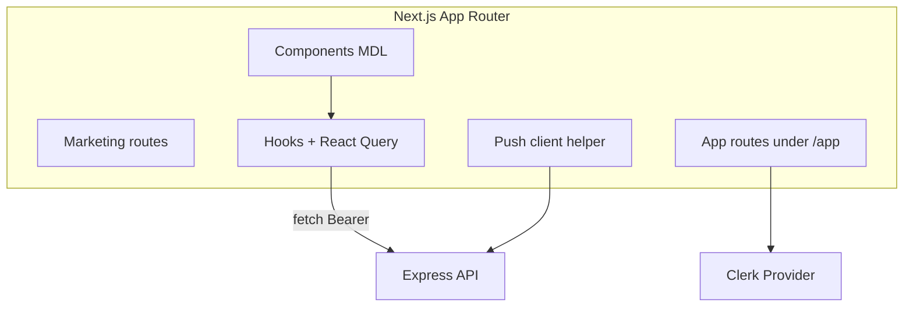
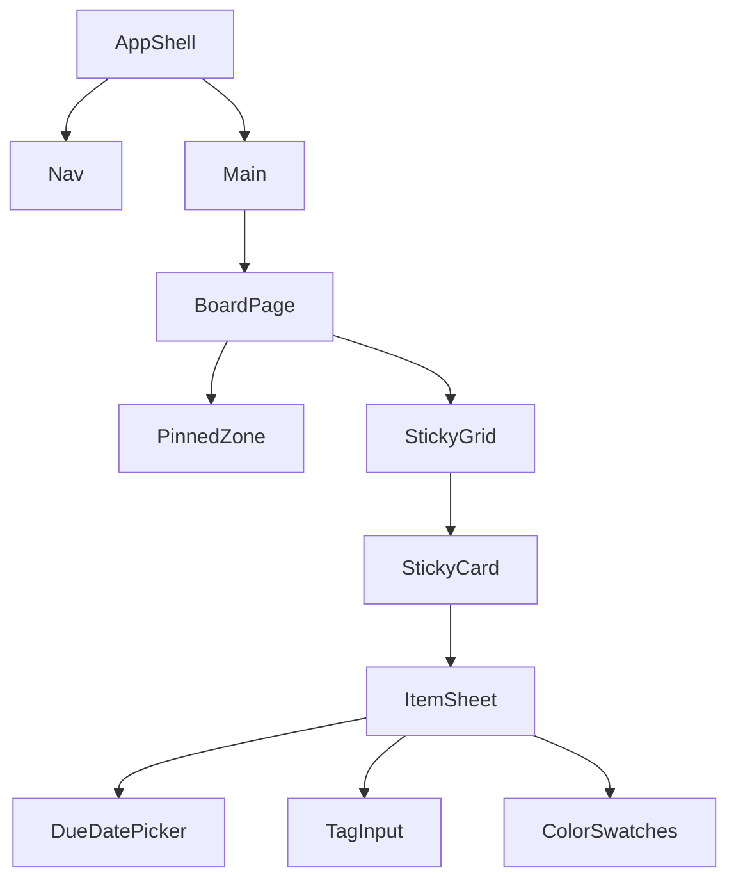
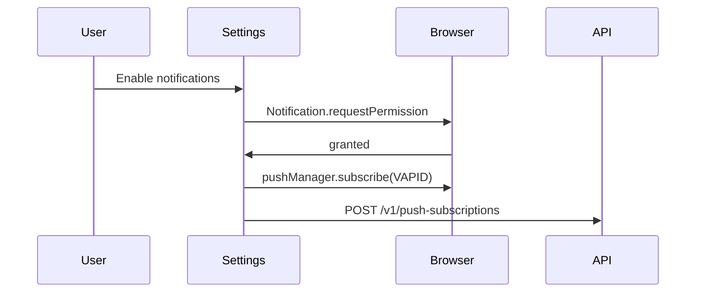

# 09 — Frontend Architecture

**Product:** StickyFlow  
**Version:** 1.0  
**Stack:** Next.js 15 · React 19 · TypeScript · Tailwind · shadcn/ui · Framer Motion · Clerk  
**Related:** [05-information-architecture](./05-information-architecture.md) · [08-api-specification](./08-api-specification.md) · [10-ui-design-system](./10-ui-design-system.md)

---

## 1. Role of the frontend

- Render Board, Agenda, Inbox, Settings with MDL.  
- Authenticate via Clerk.  
- Call Express API with Clerk JWT.  
- Register Web Push subscriptions.  
- Optimistic UI for complete/pin/archive.  

**Not responsible for:** Reminder scheduling correctness (API/worker owns that).

---

## 2. High-level diagram



---

## 3. Repository layout (target)

```text
apps/web/
  app/
    (marketing)/page.tsx
    (auth)/sign-in/[[...]]/page.tsx
    (auth)/sign-up/[[...]]/page.tsx
    app/
      layout.tsx              # App shell + nav
      page.tsx                # Board
      agenda/page.tsx
      inbox/page.tsx
      archive/page.tsx
      settings/page.tsx
      items/[id]/page.tsx
    api/                      # optional BFF proxies — prefer direct API
  components/
    board/
    item/
    agenda/
    inbox/
    layout/
    md/                       # doodle primitives
    ui/                       # shadcn
  lib/
    api-client.ts
    auth.ts
    dates.ts
    push.ts
    query-keys.ts
  hooks/
    useItems.ts
    useInbox.ts
    useMe.ts
  styles/
    globals.css
  middleware.ts               # Clerk protect /app/*
```

---

## 4. Rendering strategy

| Route type | Strategy |
|------------|----------|
| Marketing | Static / SSG |
| `/app/*` | Client-heavy CSR after Clerk; Server Components for shell OK |
| Item data | Fetched client-side with TanStack Query (recommended) |

**Why CSR for board:** Highly interactive drag/position; auth-gated personal data; avoids caching private notes on CDN.

Server Components may load shell + user display name only.

---

## 5. State management

| Concern | Tool |
|---------|------|
| Server state | TanStack Query v5 |
| Auth | Clerk |
| Ephemeral UI (sheet open, search) | React `useState` / URL search params |
| Cross-route item cache | Query invalidation on mutations |
| Form draft | Controlled inputs; debounce PATCH 400ms |

**Avoid** Redux for MVP.

### Query keys

```text
['me']
['items', view, filters]
['item', id]
['inbox', unreadOnly]
['tags']
```

---

## 6. API client

```ts
// Conceptual — do not implement until approved
async function api<T>(path: string, init?: RequestInit): Promise<T> {
  const token = await getToken();
  const res = await fetch(`${API_URL}${path}`, {
    ...init,
    headers: {
      Authorization: `Bearer ${token}`,
      'Content-Type': 'application/json',
      ...(init?.headers || {}),
    },
  });
  if (!res.ok) throw await toApiError(res);
  if (res.status === 204) return undefined as T;
  return res.json();
}
```

Env: `NEXT_PUBLIC_API_URL`, `NEXT_PUBLIC_CLERK_PUBLISHABLE_KEY`, `NEXT_PUBLIC_VAPID_PUBLIC_KEY`.

---

## 7. Component architecture



### Boundaries

| Component | Responsibility |
|-----------|----------------|
| `StickyCard` | Presentational + click |
| `ItemSheet` | Edit form + mutations |
| `BoardCanvas` | Layout (freeform or masonry — see open question) |
| `DoodleFrame` | Hand-drawn border wrapper |
| `DueChip` | remainingDays / overdue semantic |

shadcn used for Dialog, Dropdown, Input, Button baseline — **skinned** to MDL tokens ([10](./10-ui-design-system.md)).

---

## 8. Motion (Framer Motion)

| Action | Motion |
|--------|--------|
| Create sticky | Spring in opacity/scale 150–200ms |
| Complete | Soft check + fade border |
| Pin | Lift to pinned zone layout animation |
| Overdue chip | Subtle pulse once on enter (respect reduced motion) |
| Page transition | Minimal fade; no route circus |

`useReducedMotion()` → disable ornamental motion.

---

## 9. Web Push client flow



Service worker: `public/sw.js` for push events + notificationclick → `/app/items/:id`.

---

## 10. Routing & middleware

`middleware.ts` (Clerk): protect `/app/(.*)`.  
Public: `/`, sign-in/up, marketing assets.

Deep link from notification must land authenticated; else redirect sign-in with `redirect_url`.

---

## 11. Responsive breakpoints

| Breakpoint | Behavior |
|------------|----------|
| &lt;768px | Bottom tabs; sheet = full screen |
| ≥768px | Side/top nav; sheet = right drawer or center modal |
| ≥1280px | Comfortable whitespace; board max-width optional |

---

## 12. Performance budgets

| Metric | Budget |
|--------|--------|
| LCP marketing | &lt; 2.5s |
| Board TTI after auth | &lt; 2s on broadband |
| Sticky interactions | &lt; 100ms perceived |
| Bundle | Route-based splitting; Framer lazy where possible |

Virtualize board if item count &gt; 150 (Phase 2).

---

## 13. Error / empty / loading UX

| State | Pattern |
|-------|---------|
| Loading | Doodle skeleton cards |
| Error | `Callout` + Retry calling `refetch` |
| Empty board | Illustration + New Sticky |
| Optimistic fail | Rollback + toast |

---

## 14. Accessibility

- Focus rings visible on doodle components.  
- Dialog focus trap (Radix via shadcn).  
- Due status not color-only (text chip).  
- `aria-label` on icon buttons.  
- Hit targets ≥ 44px on mobile.

---

## 15. Testing strategy (frontend)

| Layer | Tool |
|-------|------|
| Unit | Vitest |
| Component | Testing Library |
| E2E | Playwright (critical flows) |

Map: [12-testing-checklist](./12-testing-checklist.md).

---

## 16. Feature flags (optional MVP+)

Simple env or Clerk metadata:

- `FF_CALENDAR`  
- `FF_STREAKS`  
- `FF_AI`  

Hide nav entries when false.

---

## 17. Scalability / future

| Need | Approach |
|------|----------|
| Offline | Service worker queue + IndexedDB (Phase 2+) |
| Realtime multi-device | Skip websockets; poll inbox every 60s + focus refetch |
| Multi-space | Space switcher in shell |
| Native apps | Expo later — keep API clean |

---

## 18. Assumptions

1. App Router (Next 15) is standard.  
2. TanStack Query is approved (if not, document Zustand+fetch — Query preferred).  
3. Direct browser → Express CORS; no mandatory Next rewrite.  
4. PWA manifest optional in MVP but needed for better iOS push story later.  
5. Board layout decision (freeform vs masonry) locked before BoardCanvas build — see [01](./01-product-requirements.md) open questions.
