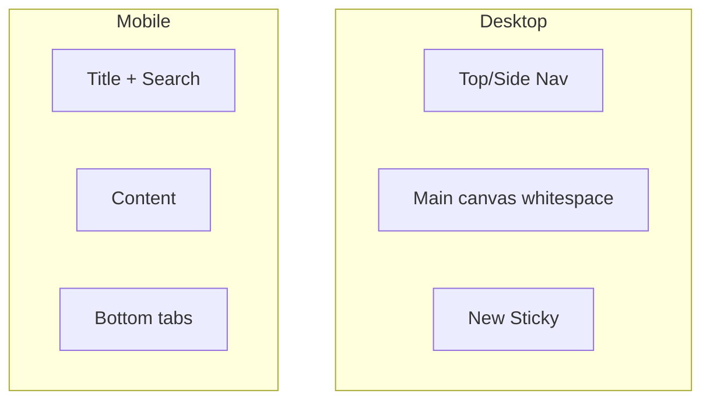

# 10 — UI Design System (Modern Doodle Language)

**Product:** StickyFlow  
**Version:** 1.0  
**Codename:** MDL — Modern Doodle Language  
**Related:** [01-product-requirements](./01-product-requirements.md) · [05-information-architecture](./05-information-architecture.md) · [09-frontend-architecture](./09-frontend-architecture.md)

---

## 1. Design intent

StickyFlow should feel like a **handcrafted productivity instrument**: the warmth of Excalidraw/tldraw strokes with the clarity of Linear/Notion/Apple Notes.

| Do | Don’t |
|----|-------|
| Irregular but consistent stroke system | Random clipart / mascots |
| Premium typography for UI chrome | Comic fonts for body text |
| Large whitespace | Dense dashboard chrome |
| Semantic motion | Confetti / emoji storms |
| White-first light canvas | Default “AI purple gradient” aesthetic |

**Brand test:** Remove the nav — the board still feels like StickyFlow, not a generic SaaS.

---

## 2. Principles

1. **Typography &gt; ornament**  
2. **Whitespace is a feature**  
3. **One job per view**  
4. **Color means identity (sticky) or status (due) — not decoration spam**  
5. **Borders can be doodled; text cannot be illegible**  
6. **Motion explains state change**  
7. **Accessible always** — doodle is never the only cue  

---

## 3. Foundations

### 3.1 Color tokens

#### Canvas & ink (light MVP)

| Token | Role | Hex (starter) |
|-------|------|----------------|
| `--canvas` | App background | `#FBFAF7` |
| `--surface` | Cards / sheets | `#FFFFFF` |
| `--ink` | Primary text | `#1C1917` |
| `--ink-muted` | Secondary text | `#78716C` |
| `--ink-faint` | Tertiary | `#A8A29E` |
| `--stroke` | Hairlines | `#E7E5E4` |
| `--stroke-doodle` | Hand border | `#292524` |
| `--accent` | CTA / focus | `#0F766E` (teal, not purple) |
| `--danger` | Delete / overdue strong | `#B91C1C` |
| `--success` | Complete | `#15803D` |
| `--warning` | Due soon | `#C2410C` |

#### Sticky fills

| Token | Hex | Feel |
|-------|-----|------|
| `butter` | `#FFF3BF` | Default warm |
| `mist` | `#E0F2FE` | Cool calm |
| `sage` | `#DCFCE7` | Fresh |
| `blush` | `#FFE4E6` | Soft alert |
| `slate` | `#E2E8F0` | Neutral |
| `lavender` | `#EDE9FE` | Use sparingly |
| `peach` | `#FFEDD5` | Warm secondary |
| `ink` | `#F5F5F4` | Low-key |

Dark mode (Phase 2): invert canvas/ink; sticky fills desaturate ~20%.

### 3.2 Typography

| Role | Family | Spec |
|------|--------|------|
| UI / body | **Source Sans 3** or **IBM Plex Sans** | 14–16px, regular/medium |
| Display / wordmark | **Fraunces** or **Literata** (soft serif) | Logo & empty-state headlines only |
| Mono (rare) | IBM Plex Mono | Debug/settings IDs |

**Do not** use Inter/Roboto/Arial as brand defaults.  
**Do not** use handwriting fonts for description fields.

Scale:

| Token | Size / line |
|-------|-------------|
| `display` | 32/40 |
| `title` | 20/28 |
| `body` | 16/24 |
| `caption` | 13/18 |
| `micro` | 11/14 |

### 3.3 Spacing

Base **4px**. Preferred scale: 4, 8, 12, 16, 24, 32, 48, 64.  
Board padding ≥ 24px. Card inner padding ≥ 16px.

### 3.4 Radius

| Token | Value | Use |
|-------|-------|-----|
| `r-sm` | 8px | Chips |
| `r-md` | 14px | Cards |
| `r-lg` | 20px | Sheets |
| `r-pill` | 999px | Avoid for primary CTAs (prefer rounded-rect) |

### 3.5 Elevation

MDL prefers **stroke over shadow**.  

| Level | Treatment |
|-------|-----------|
| Flat | No shadow |
| Sticky | 1px doodle stroke + optional 2px translate offset duplicate stroke (sketch) |
| Sheet | Soft single shadow `0 8px 24px rgba(28,25,23,0.08)` max |

No multi-layer glow stacks.

---

## 4. Doodle stroke system

### Spec

- Stroke weight: **1.5–2px**  
- Corner: slightly uneven SVG path or CSS border-image from 3 approved path presets  
- Presets: `sketch-a`, `sketch-b`, `sketch-c` rotated per card index for variety without randomness each render  
- Hover: stroke darkens 10%; no neon  

### Component: `DoodleFrame`

Props: `preset`, `color`, `padding`, `as`.  
Used by StickyCard, EmptyState panel, onboarding examples.

### Illustrations

- Empty states only (board, inbox, agenda).  
- Line-art, single ink color + one accent.  
- No characters with exaggerated cartoon faces.

---

## 5. Components

### 5.1 StickyCard

| Element | Spec |
|---------|------|
| Size | Min 180×140; max width 280 desktop |
| Fill | Sticky color token |
| Border | DoodleFrame |
| Title | `title` weight medium, 1 line truncate |
| Body | 3 lines clamp |
| DueChip | caption; semantic colors |
| Priority | Small filled dot + sr-text |
| Tags | Max 2 chips + `+N` |

States: default · hover · focus-visible · dragging · completed (50% wash + check) · overdue emphasis on chip.

### 5.2 DueChip semantics

| Status | Label example | Tone |
|--------|---------------|------|
| upcoming | `8 days` | muted |
| tomorrow | `Tomorrow` | warning |
| today | `Today` | accent |
| overdue | `Overdue · 2d` | danger |
| done | `Done` | success |

### 5.3 Buttons (shadcn skinned)

| Variant | Use |
|---------|-----|
| `primary` | New Sticky, Save (accent fill) |
| `secondary` | Quiet outline doodle |
| `ghost` | Toolbar |
| `danger` | Delete |

Min height 40px desktop / 44px mobile.

### 5.4 ItemSheet

- Right drawer ≥768px; fullscreen &lt;768px  
- Section spacing 24px  
- Sticky color strip at top  
- Footer: Complete · Archive · Delete  

### 5.5 Navigation

- Desktop: top bar or slim left rail with icons + labels  
- Mobile: bottom tabs (Board, Agenda, Inbox, More)  
- Inbox badge: accent pill with count  

### 5.6 Inputs

- Underline or soft rectangle — not heavy Material boxes  
- Focus ring: 2px accent, offset 2px  
- Date picker: prefer accessible calendar popover  

### 5.7 Reminder Inbox row

Left: unread dot.  
Main: title + relative time.  
Right: Complete / Snooze icon buttons.

---

## 6. Layout patterns

**Board:** pinned zone full width; then masonry **or** freeform (product decision).  
If freeform: snap-light optional; prevent cards from going off-canvas.

---

## 7. Motion tokens

| Token | Value |
|-------|-------|
| `motion-fast` | 120ms |
| `motion-base` | 180ms |
| `motion-slow` | 280ms |
| Easing | `cubic-bezier(0.2, 0.8, 0.2, 1)` spring alternate for create |

Framer Motion presets live in `lib/motion.ts`.

---

## 8. Iconography

- Lucide icons (consistent with shadcn).  
- Stroke 1.75.  
- Do not mix filled cartoon icons.

---

## 9. Content & microcopy tone

| Situation | Tone example |
|-----------|--------------|
| Empty board | “Park a thought. Add a due date when it matters.” |
| Overdue | “Still open — want to reschedule or complete?” |
| Push permission | “Reminders only for dated stickies. You can turn them off anytime.” |
| Error | “Couldn’t sync that change. Retry.” |

Avoid shame: never “You broke your streak!” as primary copy.

---

## 10. Accessibility checklist (design)

- Contrast body text ≥ 4.5:1 on sticky fills (darken ink on butter/peach if needed).  
- Focus visible on all controls.  
- Due status includes text.  
- Hit targets ≥ 44px.  
- Respect `prefers-reduced-motion`.  
- Screen reader labels for color (“Color: butter”).  

---

## 11. Responsive rules

| Viewport | Adjustments |
|----------|-------------|
| Mobile | Single column board; larger cards; full-screen sheet |
| Tablet | 2-col masonry |
| Desktop | 3–4 col; generous margins |

---

## 12. Asset pipeline

| Asset | Format |
|-------|--------|
| Empty illustrations | SVG |
| Favicon / OG | SVG + PNG |
| Stroke presets | Inline SVG components |

---

## 13. Anti-patterns (explicit ban list)

1. Purple-on-white gradient hero  
2. Warm cream + terracotta serif cliché as default identity (canvas may be warm, accent is teal)  
3. Broadsheet dense columns  
4. Rounded-full pill farms  
5. Emoji as primary UI  
6. Glassmorphism stacks  
7. Childish stickers on hero  

---

## 14. Implementation mapping

| Token | Tailwind |
|-------|----------|
| Colors | `theme.extend.colors` |
| Fonts | `next/font` loading Fraunces + Source Sans 3 |
| Components | `components/ui/*` shadcn + `components/md/*` doodle |

---

## 15. Assumptions

- Light theme ships first.  
- Brand accent teal is provisional pending logo work.  
- Final illustration set commissioned or designed before public launch; MVP can use 3 simple SVGs.  
- Name “StickyFlow” may change — design system remains MDL.
