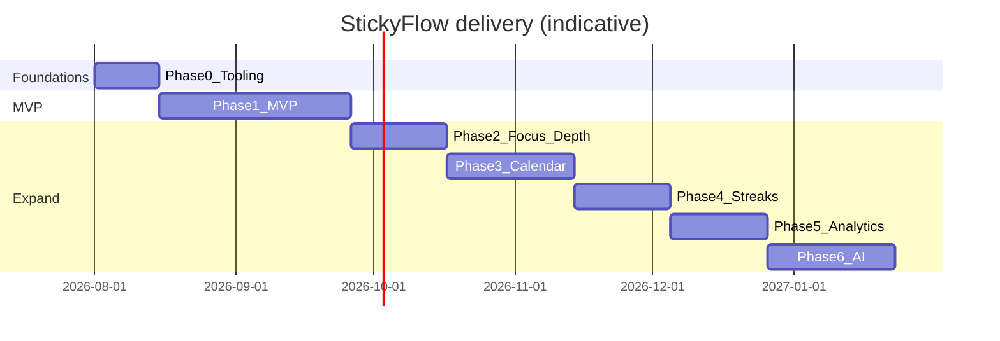
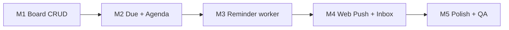

# 11 — Development Roadmap

**Product:** StickyFlow  
**Version:** 1.0  
**Last updated:** 2026-07-24  
**Related:** [01-product-requirements](./01-product-requirements.md) · [04-feature-specification](./04-feature-specification.md) · [07-backend-architecture](./07-backend-architecture.md) · [12-testing-checklist](./12-testing-checklist.md)

---

## 1. Guiding rules

1. **No application code until docs approved.**  
2. Ship vertical slices (capture → due → remind → complete) before polish sprawl.  
3. Reminder worker is P0 infrastructure — not a “later cron.”  
4. Calendar grid & Google sync **after** reminders work.  
5. Every phase ends with demoable user value + test pass.

---

## 2. Roadmap overview



Dates are **illustrative** — recalibrate after team capacity is known.

---

## 3. Phase 0 — Foundations (pre-feature)

**Goal:** Empty app deploys; auth works; DB migrates.

| Work item | Owner lens | Exit |
|-----------|------------|------|
| Monorepo or dual repos scaffold | Eng | `web` + `api` boot |
| Prisma schema MVP subset | Eng | migrate deploy staging |
| Clerk wired on web + JWT on API | Eng | `/v1/me` upsert works |
| CI lint/typecheck/test stubs | Eng | Green CI |
| Design tokens in Tailwind | Design/Eng | MDL colors/fonts live |
| Vercel + Railway + Postgres provisioned | Eng | Health checks green |
| Error tracking (Sentry) | Eng | Sample error visible |
| Privacy policy stub + env secrets | Founder/Eng | Checklist done |

**Exit criteria:** Signed-in user hits API successfully in staging.

---

## 4. Phase 1 — MVP (core loop)

**Goal:** *Wrote it once → reminded → finished.*

### 4.1 Milestones



| Milestone | Deliverables |
|-----------|--------------|
| M1 | Create/edit/delete/pin/archive/colors/tags/search; StickyCard + ItemSheet |
| M2 | dueDate; remainingDays; Agenda; rebuild reminders on write |
| M3 | Worker claim/send; policy table; cancel on complete |
| M4 | Push subscribe; inbox UI; snooze/complete paths |
| M5 | Onboarding examples; empty states; a11y pass; Playwright smoke |

### 4.2 Explicitly out of Phase 1

Streaks · AI · Google Calendar · month grid · dark mode · offline · multi-board · drawing.

### 4.3 MVP launch checklist

- [ ] WCCR instrumentation events defined  
- [ ] Reminder lag &lt; 5 min in staging soak test  
- [ ] Account export/delete  
- [ ] Load test 200 items board  
- [ ] Docs linked from README  

---

## 5. Phase 2 — Depth

| Item | Why |
|------|-----|
| Today / Focus view | Daily action surface |
| Quiet hours + morning digest | Anti-nagware |
| Due time-of-day optional | Power users |
| Checklists inside sticky | Break down work |
| Keyboard shortcuts | Sam persona |
| Dark mode | Expected hygiene |
| Filters | Scale past search-only |
| Virtualized board | 150+ items |

---

## 6. Phase 3 — Calendar

| Item | Notes |
|------|-------|
| Month/week grid | In-app first |
| Drag reschedule | Rebuild reminders |
| Google OAuth + outbound sync | Extended properties map |
| Settings connection UX | Token failures |

---

## 7. Phase 4 — Focus streak

| Item | Notes |
|------|-------|
| Nightly streak job | User TZ |
| Rest days / neutral days | Anti-guilt |
| Current/longest/completion % | Settings or subtle header |
| Guardrail metrics | Opt-out / complaint tracking |

---

## 8. Phase 5 — Analytics

| Item | Notes |
|------|-------|
| Insights page | WCCR, overdue rate |
| Funnel reminder→complete | Internal first |
| CSV export enrichment | Trust |

---

## 9. Phase 6 — AI assistant

| Item | Notes |
|------|-------|
| Opt-in provider keys | Privacy |
| Date parse suggest | Confirm required |
| Breakdown suggest | Confirm required |
| “What now?” ranker | Existing items only |

---

## 10. Team sequencing (solo or tiny team)

**Recommended order for a 1–2 eng team:**

1. Phase 0  
2. Item CRUD API + Board UI  
3. ReminderService + worker (even before Push)  
4. Inbox UI (works without Push)  
5. Web Push  
6. Agenda polish + onboarding  
7. Hardening → closed beta  

Design stays 0.5–1 step ahead of eng on MDL components.

---

## 11. Dependency graph

```mermaid
flowchart TD
  Clerk[Clerk] --> Me[/me upsert]
  Me --> Items[Items CRUD]
  Items --> Due[dueDate]
  Due --> Agenda[Agenda]
  Due --> RemBuild[Reminder rebuild]
  RemBuild --> Worker[Worker]
  Worker --> Inbox[Inbox]
  Worker --> Push[Web Push]
  Items --> Complete[Complete flow]
  Complete --> RemCancel[Cancel reminders]
  RemCancel --> Streak[Phase4 Streaks]
  Due --> Cal[Phase3 Calendar]
```

---

## 12. Risk-adjusted buffers

| Risk | Buffer |
|------|--------|
| Web Push browser quirks | +1 week in M4 |
| Freeform board DnD complexity | Prefer masonry MVP if behind |
| Clerk webhook delete | Schedule early in M5 |
| TZ/DST bugs | Dedicated test matrix ([12](./12-testing-checklist.md)) |

---

## 13. Definition of Done (per phase)

1. Feature spec acceptance criteria met.  
2. Unit/integration tests for domain logic.  
3. Playwright path for primary flow.  
4. Staging soak ≥ 48h for reminder worker.  
5. No Sev-1 open bugs.  
6. Docs updated if behavior changed.

---

## 14. Post-doc approval gate

**Stop here until founder approval.**

When approved, implementation starts at **Phase 0** only — not jumping to AI/calendar.

Approval implies agreement on:

- Unified Item model (no duplicate Task table)  
- Reminder engine inside MVP  
- Tech stack in [01](./01-product-requirements.md)  
- MDL direction in [10](./10-ui-design-system.md)

---

## 15. Open decisions that block Phase 1 UI

1. Freeform vs masonry board  
2. Final name / domain  
3. Postgres host: Supabase vs Railway  
4. Monetization (can defer past MVP engineering, not past public launch)
