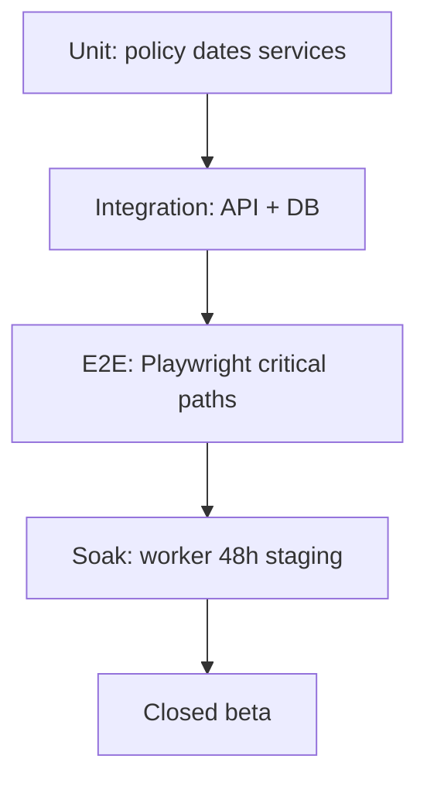

# 12 — Testing Checklist

**Product:** StickyFlow  
**Version:** 1.0  
**Last updated:** 2026-07-24  
**Related:** [03-user-flows](./03-user-flows.md) · [04-feature-specification](./04-feature-specification.md) · [08-api-specification](./08-api-specification.md) · [11-development-roadmap](./11-development-roadmap.md)

---

## 1. Test strategy

| Layer | Tools | Owns |
|-------|-------|------|
| Unit | Vitest / node:test | Reminder policy, remainingDays, Zod schemas |
| Integration | Supertest + test Postgres | Routes + transactions |
| Component | Testing Library | StickyCard, DueChip, ItemSheet |
| E2E | Playwright | Auth → create → due → complete |
| Manual | Checklist below | Push permissions, a11y, visual doodle |
| Load | k6/artillery light | 200 items list; worker backlog |

---

## 2. Environments

| Env | Purpose |
|-----|---------|
| `local` | Docker Postgres + api + web |
| `staging` | Vercel preview + Railway + staging DB |
| `prod` | Locked down; migrations reviewed |

Test Clerk instance separate from prod. Never use prod VAPID on local unless documented.

---

## 3. Unit tests — Reminder policy

| ID | Case | Expected |
|----|------|----------|
| U-REM-01 | Due in 10 days, priority none | Keys: d_minus_7, d_minus_5, d_minus_1, d_day |
| U-REM-02 | Due in 10 days, priority high | Includes d_minus_1_evening, d_day_afternoon |
| U-REM-03 | Due in 2 days | Skips d_minus_7, d_minus_5 |
| U-REM-04 | Due today | d_day (+ afternoon if high) |
| U-REM-05 | Due yesterday at create | Overdue schedule starts |
| U-REM-06 | Quiet hours fireAt 23:00 | Shifted to quietHoursEnd |
| U-REM-07 | Rebuild after due change | Old scheduled cancelled; new inserted |
| U-REM-08 | Complete | All scheduled → cancelled |
| U-REM-09 | DST spring forward | fireAt still valid instant |
| U-REM-10 | TZ Asia/Kolkata vs UTC | Civil date stable |

---

## 4. Unit tests — Remaining days / status

| ID | Case | Expected |
|----|------|----------|
| U-DAY-01 | due = today | remainingDays 0; status today |
| U-DAY-02 | due = tomorrow | remainingDays 1; tomorrow |
| U-DAY-03 | due = yesterday | negative; overdue |
| U-DAY-04 | completed | status done regardless of due |
| U-DAY-05 | no due | status note; remaining null |

---

## 5. API integration checklist

| ID | Endpoint scenario | Expect |
|----|-------------------|--------|
| I-AUTH-01 | No JWT | 401 |
| I-AUTH-02 | JWT other user item | 404 (no leak) |
| I-ME-01 | First `/me` | Creates user |
| I-ITEM-01 | Create without description | 400 |
| I-ITEM-02 | Create with dueDate | Occurrences &gt; 0 |
| I-ITEM-03 | PATCH clear dueDate | Occurrences cancelled |
| I-ITEM-04 | Complete | completedAt set; reminders cancelled |
| I-ITEM-05 | Reopen future due | Reminders rebuilt |
| I-ITEM-06 | Archive | Reminders cancelled |
| I-ITEM-07 | Restore archived dated | Reminders rebuilt if open |
| I-ITEM-08 | Delete | 204; cascades |
| I-AGENDA-01 | view=agenda | Only dueDate set, not archived |
| I-SEARCH-01 | q= match | Case-insensitive |
| I-PUSH-01 | Upsert subscription | Unique endpoint |
| I-PUSH-02 | Delete subscription | 204 |
| I-SNOOZE-01 | preset 1h | New fireAt ~ +1h |
| I-EXPORT-01 | Export | Contains items |
| I-ACCOUNT-01 | Delete without confirm | 400 |
| I-RATE-01 | Burst export | 429 |

---

## 6. Worker checklist

| ID | Case | Expect |
|----|------|--------|
| W-01 | Due occurrence | claimed → sent; inbox row |
| W-02 | Item already completed | cancelled; no push |
| W-03 | Push 410 | Subscription deleted |
| W-04 | Concurrent workers | No double inbox (unique occurrence) |
| W-05 | Failed push | Inbox still created |
| W-06 | Backlog 1k due | Drains without deadlock |

---

## 7. E2E Playwright (MVP smoke)

| ID | Flow |
|----|------|
| E-01 | Sign in → land board |
| E-02 | Create sticky → visible |
| E-03 | Set due date → DueChip shows |
| E-04 | Agenda shows same item id/title |
| E-05 | Complete from sheet → done state |
| E-06 | Archive → hidden from board |
| E-07 | Search finds sticky |
| E-08 | Deep link `/app/items/:id` opens sheet |
| E-09 | Inbox shows seeded occurrence (test harness) |
| E-10 | Snooze from inbox |

Auth: Clerk testing tokens or dedicated test user.

---

## 8. UI / visual checklist

| ID | Check |
|----|-------|
| V-01 | Sticky colors match tokens |
| V-02 | Doodle borders render on Safari/Chrome/Firefox |
| V-03 | Empty states show once CTA |
| V-04 | Mobile bottom tabs usable one-handed |
| V-05 | Sheet scroll with keyboard open (mobile) |
| V-06 | Reduced motion: no spring thrash |
| V-07 | Dark mode N/A until Phase 2 |

---

## 9. Accessibility checklist

| ID | Check |
|----|-------|
| A-01 | Tab order board → card → sheet |
| A-02 | Focus trap in delete dialog |
| A-03 | DueChip text not color-only |
| A-04 | Contrast ≥ 4.5:1 body on butter/peach |
| A-05 | Icon buttons have aria-labels |
| A-06 | Screen reader announces complete state |
| A-07 | Skip link to main content |

---

## 10. Security checklist

| ID | Check |
|----|-------|
| S-01 | CORS rejects unknown origins |
| S-02 | SQL injection via search q — parameterized |
| S-03 | XSS: description rendered as text |
| S-04 | Clerk webhook signature verified |
| S-05 | Export rate limited |
| S-06 | No note bodies in server logs |
| S-07 | Push endpoint must be https |

---

## 11. Notification / device matrix

| Browser | OS | Push | Manual result |
|---------|----|------|---------------|
| Chrome | macOS | | |
| Chrome | Windows | | |
| Firefox | macOS | | |
| Safari | macOS | | |
| Safari | iOS (PWA) | | Document limits |
| Edge | Windows | | |

Fill during M4 QA.

---

## 12. Timezone matrix

Run U-DAY / U-REM for:

- `UTC`  
- `America/Los_Angeles`  
- `America/New_York`  
- `Europe/London`  
- `Asia/Kolkata`  
- `Australia/Sydney`  

Include a DST transition week for LA and London.

---

## 13. Performance checklist

| ID | Target |
|----|--------|
| P-01 | GET /items 200 rows p95 &lt; 300ms staging |
| P-02 | Board interaction &lt; 100ms perceived |
| P-03 | Worker lag p95 &lt; 5 min |
| P-04 | Lighthouse marketing a11y ≥ 90 |

---

## 14. Streak tests (Phase 4)

| ID | Case |
|----|------|
| ST-01 | planned=0 → neutral; streak unchanged |
| ST-02 | planned=2 completed=2 → success; +1 |
| ST-03 | planned=2 completed=1 → break unless rest |
| ST-04 | Rest day → no break |
| ST-05 | Opening app does not change streak |

---

## 15. Google Calendar tests (Phase 3)

| ID | Case |
|----|------|
| GC-01 | Connect OAuth stores encrypted refresh |
| GC-02 | Create due item → event created |
| GC-03 | Change due → event patched |
| GC-04 | Complete → event updated or removed per policy |
| GC-05 | Revoke token → Settings error state |
| GC-06 | Disconnect leaves StickyFlow item intact |

---

## 16. Release gate (MVP)

All must be **pass** before public beta:

- [ ] U-REM-01…10  
- [ ] I-ITEM-02…06  
- [ ] W-01…05  
- [ ] E-01…06  
- [ ] A-01…05  
- [ ] S-01…06  
- [ ] Staging soak 48h no Sev-1  
- [ ] Privacy: delete account verified  

---

## 17. Bug severity

| Sev | Definition | Example |
|-----|------------|---------|
| S1 | Data loss / wrong user data / auth break | Item visible cross-user |
| S2 | Core loop broken | Reminders never fire |
| S3 | Feature impaired | Search misspells |
| S4 | Cosmetic | Stroke aliasing |

S1/S2 block release.

---

## 18. Assumptions

- Test DB reset between integration suites.  
- Push E2E may use mocked `web-push` in CI; real push on staging manual.  
- Playwright against staging uses secrets in CI vault.  
- Checklist is living — update when policy table changes.
